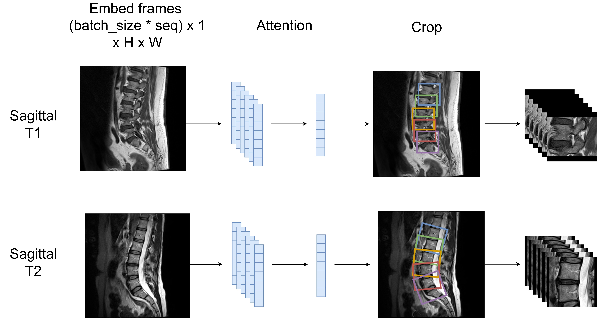
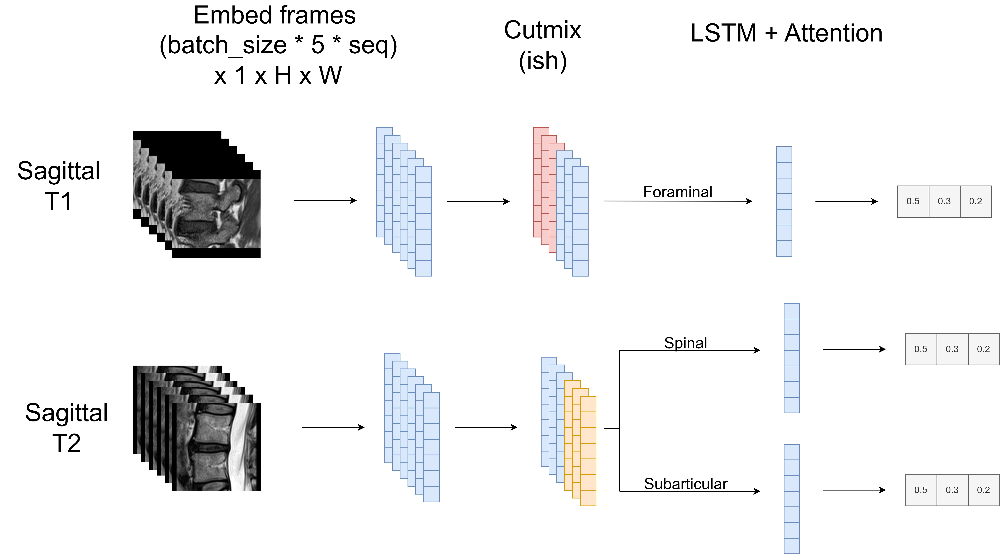

## 2nd Place Solution

Note: This repository contains part of the 2nd place solution in the RSNA 2024 Competition. For other parts of the solution, see the Kaggle write-up [here](https://www.kaggle.com/competitions/rsna-2024-lumbar-spine-degenerative-classification/discussion/539452).

Thanks to my awesome teammates, I learned a lot from them and we worked hard for this result. Also, thanks to RSNA and Kaggle for hosting this competition. Although Kevin's models were not included in the ensemble, his discussions early on in the competition were very helpful.

TLDR; My solution is a 2-stage pipeline that uses sagittal images only. Spinal and subarticular labels are inferred from sagittal T2s and foraminal labels from sagittal T1s. I use many data augmentation tricks, pseudo labeling, TTA, and more. For details, keep reading!

## Stage 1

In this stage, I predict the location of each disc using the competition coordinates and then crop around the area of each disc. I use the coordinate dataset [here](https://www.kaggle.com/datasets/brendanartley/lumbar-coordinate-pretraining-dataset), which contains corrected coordinates and
additional coordinates for Sagittal T2s.

The T1 and T2 pipelines are very similar in this stage. I pass the eight middle frames of each image sequence into a 2D backbone with an attention head to predict ten coordinates (two per disc). For T1s, each level has one coordinate corresponding to the right and left foraminal zones. For T2s, each level has one coordinate behind each disc and one in front of each disc. The performance of the localization models was quite strong, with predictions falling within 5 pixels of the ground truth coordinates ~99.1% of the time.

I take the average distance between levels as the height. For T1s, the width is the same as the height, but for T2s, I take the average disc width. You can see an example crop in the figure below.

<h1 align="center">

</h1>


## Stage 2

In this stage, we classify the labels for each cropped sequence. Each sequence is treated equally, regardless of the disc level. My best submission used `0.5*loss_with_labels + 0.5*loss_with_pseudolabels` during training.  In this codebase, I remove noisy labels during training. This was done by created an out of fold ensemble with my teammates, and then removing data points when the prediction was very different from the given label (confident learning). In hindsight I should have experimented with other denoising strategies sooner as we only experimented with this on the final day of the competition.

For T1s, I pass the middle 24 frames into an encoder, pass the output sequence of embeddings into an LSTM layer, and then use attention to pool the embeddings into a single feature representation. During training, I apply heavy augmentations, flip the sequence order, combine left/right sides from different sequences, and apply manifold mixup to the embeddings. The idea was to try and force the model to extract information from both sides of the sequence. For T2s, the process is similar. It differs in that it uses between 5 - 16 frames and different image sizes. The differing sizes increased the diversity of predictions. Finally, nine rotations provide TTA during inference.

<h1 align="center">

</h1>

I also worked on an Axial T2 pipeline that improved my CV by 0.01-0.02, but it was not strong enough to improve our overall team CV. Happy Kaggling!

## Run Instructions

#### 1. Build environment

```
conda config --add channels conda-forge
conda config --remove channels defaults
conda config --add channels pytorch
conda config --add channels nvidia

conda create --prefix ../rsna_env python=3.10
conda activate ../rsna_env
conda install pytorch==2.1.0 torchvision==0.16.0 torchaudio==2.1.0 pytorch-cuda==11.8 -c pytorch -c nvidia
pip install -r ./requirements.txt
```

#### 2. Setup data + directories

```
mkdir ./data/
mkdir ./data/raw/
mkdir ./data/metadata/
mkdir ./data/checkpoints/
```

Download and unzip the competition data from [here](https://www.kaggle.com/competitions/rsna-2024-lumbar-spine-degenerative-classification/data) and unzip the data into the `./data/raw/` directory.

Download metadata for training from [here](https://www.kaggle.com/datasets/brendanartley/rsna2024-solution-metadata/data) and unzip the data into the `./data/metadata/` directory. The linked dataset also contains some pretrained models which you can place in the `./data/checkpoints/` directory if you would just like to perform inference.

#### 3. Process dicoms

```
python -m src.preprocess.rsna
```
#### 4. Train models

Training requires a single GPU with >=34GB of VRAM and will take ~24hrs. You should be able to achieve similar results with a lower batch size, but this will require further tuning. If you have GPUs with more VRAM you can speed up training by setting grad_checkpointing=False in the run.sh scripts. I trained the models using `Ubuntu 22.04` and 1x `A100 40 GB`.


Model weights will be saved in the `./data/checkpoints/` directory. Each model comes with a json file with performance metrics, model info, fold info, and more. This data will be saved in the same directory as the model.

```
# Debug run
python train.py -G=0 -C=cfg_stage2_s2_sp1 fast_dev_run=True batch_size=2 seed=0 save_weights=True

# Complete training run
chmod u+x ./run.sh
nohup ./run.sh > nohup.out &
```

#### 5. Inference

You can call the following command to obtain a CV score. The script will generate predictions for each model as CSVs in the working directory.

```
python -m src.modules.infer
```
